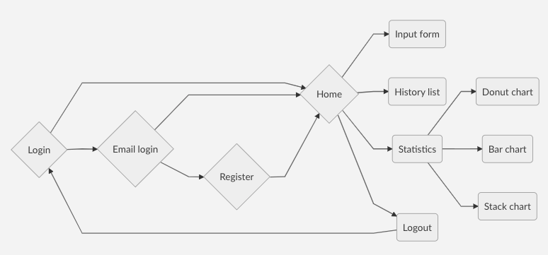
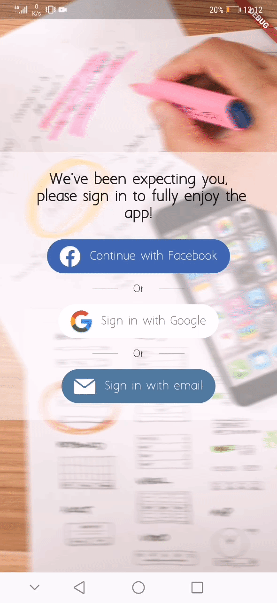
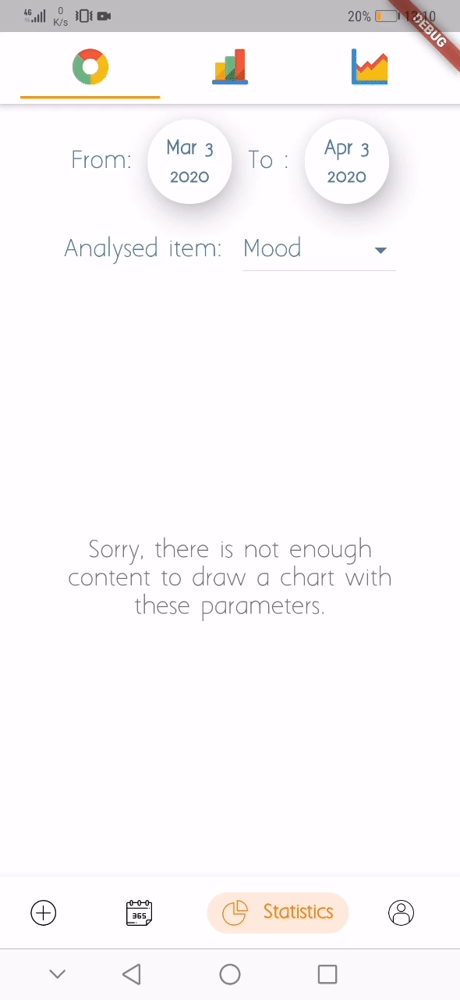

# The project

This project was implemented to try out **flutter** and its **widgets** while building a prototype for a friend. If you go through the code you can see that I use a wide range of tools offered by the framework and many additional [packges](https://pub.dev/packages/). 

This project works with `firebase_auth`,  `google_sign_in`,  `flutter_facebook_login` for the authentification with a Google account, a Facebook account or an email address. Regarding the data, everything is stored with `cloud_firestore` that caches the data locally to allow the app to work offline but also save everything online. 

Some other interesting packages were in use like `flutter_redux` to have different levels of state management, as every widget can be stateful in flutter redux can look useless but it's definitely not as it simplifies the way to interact between widgets. And finally `flutter_localizations`,`flutter_svg`, `http`, `camera`, etc.

The aim of the app is to offer a tool to track daily data like productivity, mood and other things people want to keep track of. The user should be able to manage his own items and track what matters to him. From this data the app provides a history and some statistics (charts) to help the user to understand it.

# The screens

# Screenshots

						